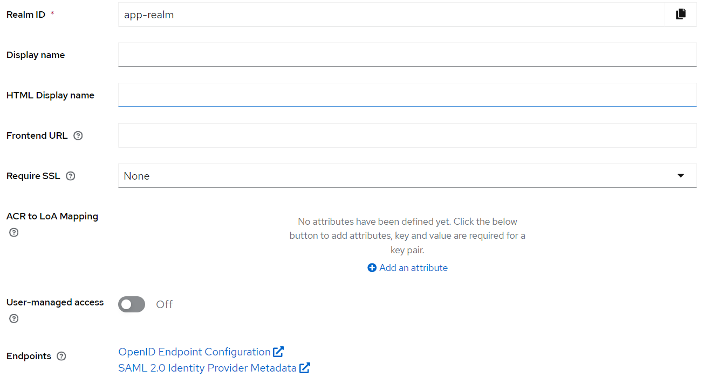
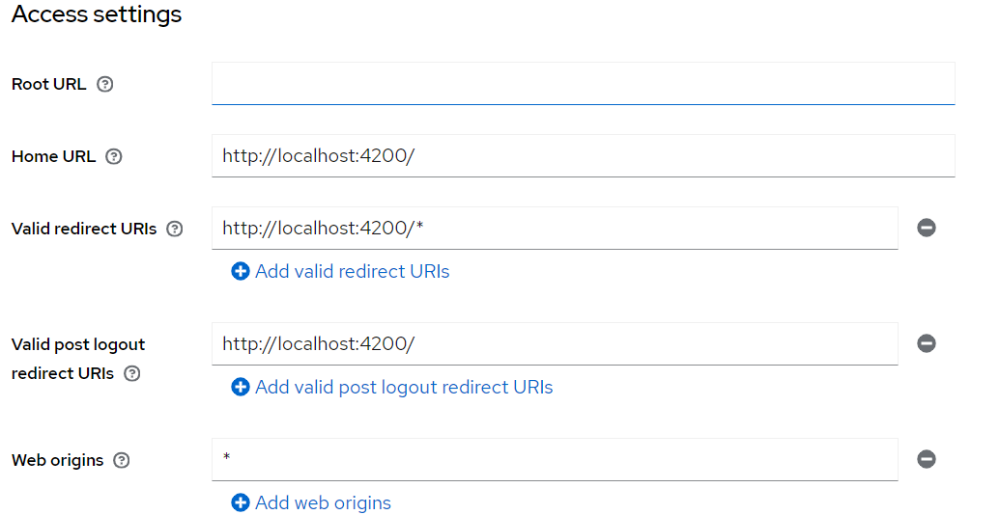
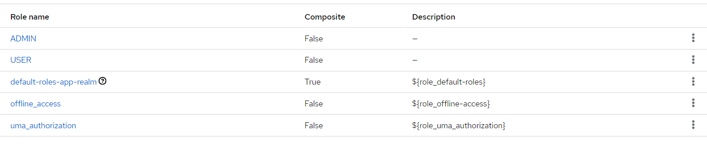
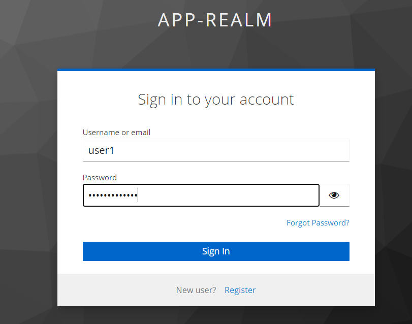
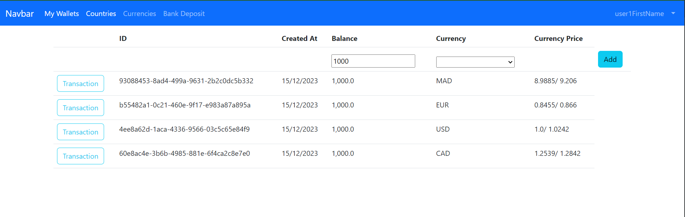
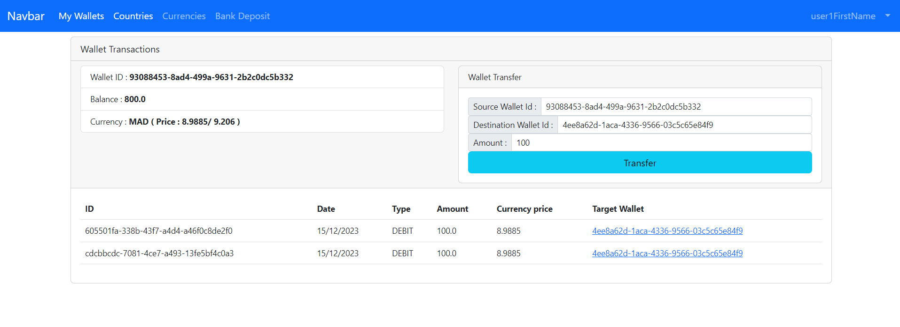

# Securing a Spring/Angular application with Keycloak
- [📖 Overview](#-overview)
- [📦 Dependencies](#-dependencies)
- [⚙ Configuring Keycloak](#-configuring-keycloak) 
- [🚀 Code Snippets](#-code-snippets) 
    - [📁 Securing ebank-service](#-securing-ebank-service)
    - [📁 Securing wallet-service](#-securing-wallet-service)
    - [📁 Securing wallet-front-angular](#-securing-wallet-front-angular)
- [✅ Screenshots](#-screenshots)


## 📖 Overview
This repository contains a simple application that demonstrates how to secure a Spring/Angular application with Keycloak.

## 📦 Dependencies


## ⚙ Configuring Keycloak
1. Create a new realm called `app-realm`.

2. Create a new client called `ebank-client` with the following access settings:

3. Create roles `ADMIN` and `USER` for the client `ebank-client`.

4. Create users and assign them some roles:

**Assigning `ADMIN` and `USER` roles to a user:**


## 🚀 Code Snippets
### 📁 Securing ebank-service
1. application.properties:
```properties
server.port=8084
spring.datasource.url=jdbc:h2:mem:currency-deposit
spring.h2.console.enabled=true
# Keycloak configuration
# Name of the realm
keycloak.realm = app-realm
# Name of the client
keycloak.resource = ebank-client
# Only accept bearer tokens
keycloak.bearer-only = true
# URL of the Keycloak server
keycloak.auth-server-url = http://localhost:8080
# Disable SSL certificate verification
keycloak.ssl-required = none
```
2. Class `KeycloakAdapterConfig`:
```java
@KeycloakConfiguration
public class KeycloakAdapterConfig {
    // To retrieve Keycloak configuration from application.properties
    @Bean
    KeycloakSpringBootConfigResolver springBootConfigResolver() {
        return new KeycloakSpringBootConfigResolver();
    }
}
```
3. Class `KeycloakSecurityConfig`:
```java
// To enable Spring Security
@KeycloakConfiguration
// To enable method security with @PreAuthorize and @PostAuthorize
@EnableGlobalMethodSecurity(prePostEnabled = true)

// This approach is deprecated on spring boot 3.0.0
// todo: migrate to spring boot 3.0.0
public class KeycloakSecurityConfig extends KeycloakWebSecurityConfigurerAdapter {
    // To register Keycloak authentication strategy for public or confidential applications
    @Override
    protected SessionAuthenticationStrategy sessionAuthenticationStrategy() {
        return new RegisterSessionAuthenticationStrategy(new SessionRegistryImpl());
    }

    @Override
    protected void configure(AuthenticationManagerBuilder auth) throws Exception {
        // To configure KeycloakAuthenticationProvider with default spring security authentication manager
        auth.authenticationProvider(keycloakAuthenticationProvider());
    }

    @Override
    protected void configure(HttpSecurity http) throws Exception {
        super.configure(http);
        // We work with JWT tokens, so we don't need CSRF as we don't use cookies
        http.csrf().disable();
        // To enable H2 console access without authentication
        http.authorizeRequests().antMatchers("/h2-console/**").permitAll();
        // To enable H2 console access without X-Frame-Options header
        http.headers().frameOptions().disable();
        // To enable CORS
        http.authorizeRequests().anyRequest().authenticated();
    }
}
```
4. Class EBankRestController:
Adding `@PreAuthorize("hasAuthority('ADMIN')")` to the endpoint, only users with ADMIN role can access this endpoint.
Adding `@PreAuthorize("hasAuthority('USER')")` to the endpoint, only users with USER role can access this endpoint.
```java
@RestController
@CrossOrigin("*")
public class EBankRestController {
    @Autowired
    private EBankServiceImpl eBankService;
    @PostMapping("/currencyTransfer")
    // Only users with ADMIN role can access this endpoint
    @PreAuthorize("hasAuthority('ADMIN')")
    public CurrencyTransferResponse currencyTransfer(@RequestBody NewWalletTransferRequest request){
        return this.eBankService.newWalletTransaction(request);
    }

    @GetMapping("/currencyDeposits")
    // Only users with USER role can access this endpoint
    @PreAuthorize("hasAuthority('USER')")
    public List<CurrencyDeposit> currencyDepositList(){
        return eBankService.currencyDeposits();
    }
}
```

### 📁 Securing wallet-service
1. application.properties:
```properties
server.port=8082
spring.h2.console.enabled=true
spring.datasource.url=jdbc:h2:mem:currenciesDb
spring.graphql.graphiql.enabled=true
# Keycloak configuration
# Name of the realm
keycloak.realm = app-realm
# Name of the client
keycloak.resource = wallet-client
# Only accept bearer tokens
keycloak.bearer-only = true
# URL of the Keycloak server
keycloak.auth-server-url = http://localhost:8080
# Disable SSL certificate verification
keycloak.ssl-required = none
```

2. Class `KeycloakAdapterConfig`:
```java
@Configuration
public class KeycloakAdapterConfig {
  @Bean
  KeycloakSpringBootConfigResolver springBootConfigResolver() {
    return new KeycloakSpringBootConfigResolver();
  }
}
```

3. Class `KeycloakSecurityConfig`:
```java
@KeycloakConfiguration
@ComponentScan(basePackageClasses = KeycloakSecurityComponents.class)
@EnableGlobalMethodSecurity(prePostEnabled = true)
public class SecurityConfig extends KeycloakWebSecurityConfigurerAdapter {
    @Override
    protected SessionAuthenticationStrategy sessionAuthenticationStrategy() {
        return new RegisterSessionAuthenticationStrategy(new SessionRegistryImpl());
    }

    @Override
    protected void configure(AuthenticationManagerBuilder auth) throws Exception {
        auth.authenticationProvider(keycloakAuthenticationProvider());
    }

    @Override
    protected void configure(HttpSecurity http) throws Exception {
        super.configure(http);

        http.csrf().disable();
        http.authorizeRequests().antMatchers("/h2-console/**").permitAll();
        http.authorizeRequests().antMatchers("/graphql/**").permitAll();
        http.authorizeRequests().antMatchers("/graphiql/**").permitAll();
        http.headers().frameOptions().disable();
        http.authorizeRequests().anyRequest().authenticated();
    }
}
```

### 📁 Securing wallet-front-angular
1. app.module.ts:
```typescript
import {KeycloakAngularModule, KeycloakService} from "keycloak-angular";

export function kcFactory(kcService : KeycloakService) {
  return () => {
    kcService.init({
      config: {
        realm: "app-realm",
        clientId: "ebank-client",
        url: "http://localhost:8080"
      },
      initOptions: {
        onLoad: "login-required",
        checkLoginIframe: true
      },
    })
  }
}

@NgModule({
  providers: [
    {provide: APP_INITIALIZER, deps: [KeycloakService], useFactory: kcFactory, multi: true}
  ],
  // ... rest of the code
})
```

2. Configuring the routes:
```typescript
const routes: Routes = [
  {
    path : "currencies", component : CurrenciesComponent
  },
  {
    path : "continents", component : ContinentsComponent
  },
  {
    path : "wallets", component : WalletsComponent, canActivate : [AuthGuard], data : {roles : ["USER"]}
  },
  {
    path : "transactions/:walletId", component : WalletTransactionsComponent, canActivate : [AuthGuard], data : {roles : ['USER']}
  },
  {
    path : "currencyDeposit", component : CurrencyDepositComponent,
  }
];
```

3. Create guard:
```typescript
import { Injectable } from '@angular/core';
import {
  ActivatedRouteSnapshot,
  Router,
  RouterStateSnapshot
} from '@angular/router';
import { KeycloakAuthGuard, KeycloakService } from 'keycloak-angular';

@Injectable({
  providedIn: 'root'
})
export class AuthGuard extends KeycloakAuthGuard {
  constructor(
    protected override readonly router: Router,
    protected readonly keycloak: KeycloakService
  ) {
    super(router, keycloak);
  }

  public async isAccessAllowed(
    route: ActivatedRouteSnapshot,
    state: RouterStateSnapshot
  ) {
    // Force the user to log in if currently unauthenticated.
    if (!this.authenticated) {
      await this.keycloak.login({
        redirectUri: window.location.origin
      });
    }

    // Get the roles required from the route.
    const requiredRoles = route.data['roles'];

    // Allow the user to proceed if no additional roles are required to access the route.
    if (!Array.isArray(requiredRoles) || requiredRoles.length === 0) {
      return true;
    }

    // Allow the user to proceed if all the required roles are present.
    return requiredRoles.every((role) => this.roles.includes(role));
  }
}
```

## ✅ Screenshots
1. Login page:


2. Explore wallets


3. Make transactions

